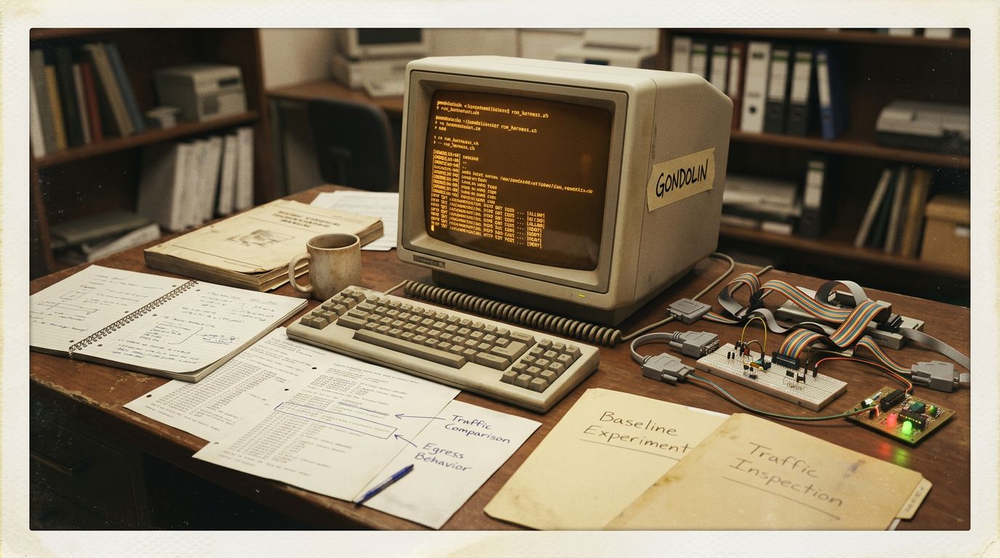

# harness-egress-lab



Standalone Gondolin-based lab for running coding harnesses inside monitored VMs, capturing HTTP egress, comparing configuration variants, and generating doc-ready summaries.

## Initial scope
- profile: `claude-code`
- provider scenario: `openrouter`
- modes:
  - `openrouter-vanilla`
  - `openrouter-noextra`

## What this repo gives you
- reproducible harness image builds
- monitored VM sessions with HTTP logging
- interactive or log-only egress policy modes
- NDJSON logs that are easy to diff and post-process
- summary, diff, and Markdown report commands

## Quick start

Install and build the CLI:

```bash
pnpm install
pnpm build
```

Build the image:

```bash
GONDOLIN_GUEST_SRC=/tmp/gondolin/guest \
node dist/cli.js build-image claude-code \
  --output ./.artifacts/images/claude-code
```

Run the baseline session:

```bash
node dist/cli.js run claude-code \
  --mode openrouter-vanilla \
  --image ./.artifacts/images/claude-code \
  --workspace . \
  --http-log ./logs/claude-vanilla.ndjson \
  --confirm-mode log-only \
  --shell
```

Inside the VM:

```bash
claude -p "Reply with exactly: vanilla-ok"
```

Run the comparison session:

```bash
node dist/cli.js run claude-code \
  --mode openrouter-noextra \
  --image ./.artifacts/images/claude-code \
  --workspace . \
  --http-log ./logs/claude-noextra.ndjson \
  --confirm-mode log-only \
  --shell
```

Inside the VM:

```bash
claude -p "Reply with exactly: noextra-ok"
```

Summarize and diff:

```bash
node dist/cli.js summarize ./logs/claude-vanilla.ndjson --profile claude-code
node dist/cli.js summarize ./logs/claude-noextra.ndjson --profile claude-code
node dist/cli.js diff ./logs/claude-vanilla.ndjson ./logs/claude-noextra.ndjson --profile claude-code
```

Generate a report:

```bash
node dist/cli.js report claude-code ./logs/claude-noextra.ndjson \
  > docs/reports/claude-code-noextra.md
```

## Commands
- `build-image <profile>`
- `run <profile>`
- `summarize <log.ndjson>`
- `diff <a.ndjson> <b.ndjson>`
- `report <profile> <log.ndjson>`
- `profiles`

## Recommended reading
- `docs/workflow.md` — concise full workflow to reproduce experiments
- `docs/claude-code.md` — profile-specific behavior and caveats
- `docs/reports/` — stored run reports derived from captured logs
- `docs/architecture.md` — code layout and design
- `harness-egress-lab-plan.md` — original implementation plan and findings

## Notes
- HTTP is the main focus in v1
- SSH git/exec confirmation is supported when `SSH_AUTH_SOCK` is set
- `log-only` is best for reproducible batch comparisons
- `first-host` and `always` are best for exploratory runs
