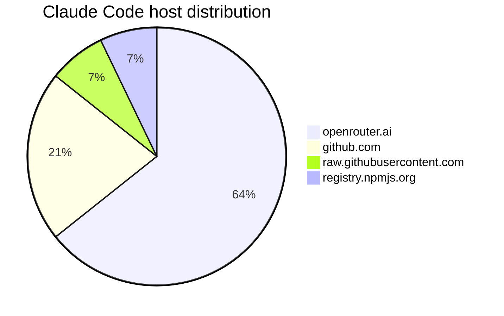

# harness-egress-lab plan

## Goal

Create a small standalone repository, `harness-egress-lab`, that depends on Gondolin as a normal npm dependency and makes it easy to:

- build or use a VM image containing a coding harness
- run that harness inside a Gondolin VM
- inspect outbound traffic interactively with allow/deny popups
- log all intercepted HTTP traffic to structured host-side files
- compare multiple configuration variants of the same harness
- generate concise reports and visualizations that can be dropped into provider-specific docs

Initial scope:

- one harness profile: **Claude Code**
- one provider-routing scenario: **OpenRouter**
- two comparison modes:
  - vanilla Claude Code behavior
  - `CLAUDE_CODE_DISABLE_NONESSENTIAL_TRAFFIC=1`

Secondary scope:

- reusable architecture so more harness profiles can be added later without changing the core runner
- a small analysis/reporting tool for summarizing logs and generating tables/charts/snippets for docs

---

## Why this repo should exist

The work done in this Gondolin checkout showed that Gondolin is a strong substrate for egress analysis, but the current implementation lives as ad hoc example code inside the Gondolin repo. That is fine for exploration, but not ideal for:

- repeated experiments
- publishing findings
- comparing harnesses
- onboarding someone else into the workflow
- keeping harness-specific logic separate from Gondolin itself

`harness-egress-lab` should package the reusable test harness around Gondolin so that the workflow becomes:

1. pick a harness profile
2. build or select an image
3. run monitored session(s)
4. collect NDJSON logs
5. summarize and diff the logs
6. drop results into docs

---

## What has already been done in this Gondolin repo

The current work in `/private/tmp/gondolin/host/examples` established the proof of concept.

### Files added/changed

#### 1. `host/examples/confirm-bash.ts`

This existing example was extended substantially.

Current behavior added:

- supports custom image selection via `GONDOLIN_CONFIRM_IMAGE`
- optionally mounts current host directory at `/workspace` via `GONDOLIN_CONFIRM_MOUNT_CWD=1`
- supports OpenRouter-specific Claude Code env wiring via `GONDOLIN_CONFIRM_OPENROUTER=1`
- supports request-by-request prompting via `GONDOLIN_CONFIRM_ALWAYS=1`
- logs intercepted HTTP request/response traffic to NDJSON on the host via `GONDOLIN_CONFIRM_HTTP_LOG`
- now forwards `CLAUDE_CODE_DISABLE_NONESSENTIAL_TRAFFIC` to the guest when set on the host
- uses popup dialogs where possible, with terminal fallback
- works without requiring `SSH_AUTH_SOCK`
- uses `sandbox.imagePath` correctly so the custom image is actually used

Important env behavior currently implemented for OpenRouter mode:

- `ANTHROPIC_BASE_URL=https://openrouter.ai/api`
- `ANTHROPIC_AUTH_TOKEN=$OPENROUTER_API_KEY`
- `ANTHROPIC_API_KEY=""` explicitly blank

That was changed to match OpenRouter's documented Claude Code guidance.

#### 2. `host/examples/claude-code.json`

A custom Gondolin image config for Claude Code was created.

Notable details:

- Alpine-based image
- installs runtime dependencies like `bash`, `nodejs`, `npm`, `git`, `curl`, `openssh`, `ripgrep`
- copies staged Claude Code package contents into `/opt/claude-code`
- installs wrappers into `/usr/local/bin/claude` and `/usr/bin/claude`

This avoids relying on runtime installation noise for every test run.

#### 3. `host/examples/.claude-code-staging/*`

Staging artifacts were created to simplify image composition:

- unpacked `@anthropic-ai/claude-code` package
- small wrapper script that runs `node /opt/claude-code/cli.js "$@"`

#### 4. `host/examples/claude-code.md`

A small usage doc was created for the current experiment.

---

## What was learned from the Claude Code experiment

These are key findings that should be carried into `harness-egress-lab` as initial documentation and test cases.

### A. OpenRouter wiring for Claude Code

The correct OpenRouter-compatible environment for Claude Code is:

- `ANTHROPIC_BASE_URL=https://openrouter.ai/api`
- `ANTHROPIC_AUTH_TOKEN=<openrouter api key>`
- `ANTHROPIC_API_KEY=""`

This matters because earlier wiring used:

- `/api/v1/anthropic`
- `ANTHROPIC_API_KEY`

That did not match the OpenRouter Claude Code integration guide.

### B. Claude Code does not become “OpenRouter only” by default

In the vanilla OpenRouter-backed run, Claude Code still contacted multiple non-provider hosts.

Observed hosts included:

- `openrouter.ai`
- `api.anthropic.com`
- `github.com`
- `raw.githubusercontent.com`
- `registry.npmjs.org`

### C. Direct Anthropic telemetry happens in vanilla mode

Observed endpoint:

- `POST https://api.anthropic.com/api/event_logging/batch`

Observed event types included:

- `tengu_reset_pro_to_opus_default`
- `tengu_api_success`
- `tengu_tool_use_progress`
- `tengu_file_operation`
- later additional events like `tengu_notification_method_used`, `tengu_cancel`

Observed metadata fields included at least:

- `event_name`
- `client_timestamp`
- `model`
- `session_id`
- `user_type`
- `betas`
- `env.platform`
- `env.node_version`
- likely additional runtime/context fields beyond the truncated preview

### D. `CLAUDE_CODE_DISABLE_NONESSENTIAL_TRAFFIC=1` appears meaningful

Comparison of `gondolin-http-log.ndjson` vs `claude-http-noextra.ndjson` showed:

- direct `api.anthropic.com/api/event_logging/batch` traffic disappeared in the `noextra` run
- GitHub/raw GitHub/npm traffic still remained

So this flag appears to reduce or eliminate direct Anthropic telemetry, but does **not** yield provider-only traffic.

### E. OpenRouter auth failures are a separate issue

A later run produced repeated:

- `401 https://openrouter.ai/api/v1/messages?beta=true`
- `{"error":{"message":"User not found.","code":401}}`

This correlated with a bad/missing OpenRouter key in that run, not with the telemetry suppression flag itself.

### F. OpenRouter compatibility is imperfect

Observed:

- `POST https://openrouter.ai/api/v1/messages/count_tokens?beta=true`
- `404 Not Found`

This suggests Claude Code may call Anthropic-compatible endpoints that OpenRouter does not fully expose or expose under a different shape/path.

That should be documented as a compatibility note in the new repo.

---

## What the standalone repo should contain

## Repository name

`harness-egress-lab`

Good because it communicates:

- harness-agnostic design
- egress/network focus
- experimental/lab workflow

---

## Repository goals

### Primary goals

- minimal but polished standalone repo
- depends on `@earendil-works/gondolin`
- reproducible harness-image build flow
- one-command monitored runs
- structured traffic logs
- quick comparison across variants
- concise analysis output suitable for docs

### Non-goals for v1

- supporting every harness immediately
- capturing all non-HTTP protocols
- building a polished web app dashboard
- perfect provider-agnostic abstraction from day one

---

## Proposed v1 architecture

```text
harness-egress-lab/
  package.json
  tsconfig.json
  README.md
  AGENTS.md
  .gitignore

  src/
    cli.ts
    run-profile.ts
    monitor/
      popup-policy.ts
      traffic-log.ts
      env.ts
      shell-attach.ts
      http-hooks.ts
    profiles/
      claude-code.ts
      types.ts
    analysis/
      summarize-log.ts
      diff-logs.ts
      render-report.ts

  images/
    claude-code.json

  staging/
    claude-code/
    claude-wrapper

  docs/
    architecture.md
    claude-code.md
    reports/
      claude-code-openrouter.md

  logs/
    .gitkeep
```

---

## Core design principles

### 1. Generic runner, profile-specific config

The core runner should know how to:

- create a VM
- attach policy popups
- log HTTP traffic
- mount workspace
- pass env vars
- optionally launch a shell or a direct command

Harness-specific behavior should live in profiles.

### 2. Profiles should be declarative where possible

A profile should define things like:

- profile name
- default image config path or built image path
- default command
- env mapping rules
- docs URL
- known provider compatibility notes

Example:

```ts
export type HarnessProfile = {
  name: string;
  description: string;
  imageConfigPath?: string;
  defaultCommand: string[];
  build?: {
    strategy: "gondolin-image";
    configPath: string;
  };
  envMapper: (hostEnv: NodeJS.ProcessEnv, options: RunOptions) => Record<string, string>;
};
```

### 3. Logs should be portable and simple

Use NDJSON as the canonical log format.

Each line should be one event. For example:

```json
{"type":"request", ...}
{"type":"response", ...}
```

This keeps the logs:

- easy to diff
- easy to summarize with `jq`
- easy to post-process in TypeScript
- easy to archive with experiment metadata

### 4. Analysis tooling should produce doc-ready output

The analysis tooling should not just print raw stats. It should produce:

- host frequency tables
- lists of unique contacted endpoints
- status code summaries
- provider vs non-provider breakdown
- known telemetry endpoint detection
- Markdown output that can be pasted into docs

---

## Proposed CLI surface for v1

### Commands

#### `harness-egress-lab build-image <profile>`

Builds the image for the given profile.

Example:

```bash
harness-egress-lab build-image claude-code
```

Behavior:

- runs Gondolin image builder using the profile's config
- outputs to a deterministic directory, e.g. `./.artifacts/images/claude-code`
- stores resulting build id in local metadata for later reuse

#### `harness-egress-lab run <profile>`

Runs a monitored VM session.

Example:

```bash
harness-egress-lab run claude-code \
  --provider openrouter \
  --http-log ./logs/claude-vanilla.ndjson \
  --confirm-always
```

Important options:

- `--provider openrouter`
- `--image <path-or-build-id>`
- `--workspace <host-path>`
- `--http-log <path>`
- `--confirm-always`
- `--env KEY=VALUE`
- `--shell`
- `--command 'claude'`
- `--allow-host <host>`
- `--deny-host <host>`

#### `harness-egress-lab summarize <log.ndjson>`

Outputs a compact summary.

Suggested output sections:

- total requests/responses
- hosts contacted
- unique URLs
- non-200 responses
- detected telemetry endpoints
- likely provider requests
- likely update/plugin traffic

#### `harness-egress-lab diff <a.ndjson> <b.ndjson>`

Compares two runs.

Suggested output sections:

- hosts present only in A
- hosts present only in B
- endpoint counts delta
- non-200 delta
- telemetry present/absent comparison
- provider-only ratio comparison

#### `harness-egress-lab report <profile> <log.ndjson>`

Generates a Markdown report suitable for `docs/reports/*`.

This is the “small tool” requested for visualization/documentation.

Output should include:

- summary table
- notable endpoints
- policy interpretation
- short conclusions
- optional Mermaid diagram or simple ASCII table if useful

---

## Claude Code profile design for v1

### Image

Start by porting the current working image config.

Artifacts needed:

- `images/claude-code.json`
- `staging/claude-code/` package content
- `staging/claude-wrapper`

### Environment modes

The Claude Code profile should support at least these named modes:

#### `openrouter-vanilla`

Sets:

- `ANTHROPIC_BASE_URL=https://openrouter.ai/api`
- `ANTHROPIC_AUTH_TOKEN=$OPENROUTER_API_KEY`
- `ANTHROPIC_API_KEY=""`

Does **not** set:

- `CLAUDE_CODE_DISABLE_NONESSENTIAL_TRAFFIC`

#### `openrouter-noextra`

Same as above, plus:

- `CLAUDE_CODE_DISABLE_NONESSENTIAL_TRAFFIC=1`

### Startup command

Default command:

- `claude`

Fallback option:

- `--shell`

### Known caveats to document

- OpenRouter requests may fail with `401 User not found` if the key is wrong
- Claude Code may hit unsupported endpoints like `messages/count_tokens`
- GitHub/npm traffic may still occur even in reduced-traffic mode

---

## Traffic logging design

The current logging in `confirm-bash.ts` is good enough to port as the initial implementation.

### v1 log schema

#### Request event

```json
{
  "type": "request",
  "startedAt": "...",
  "method": "POST",
  "url": "https://...",
  "headers": { ... },
  "bodyPreview": "..."
}
```

#### Response event

```json
{
  "type": "response",
  "finishedAt": "...",
  "method": "POST",
  "url": "https://...",
  "status": 200,
  "statusText": "OK",
  "headers": { ... },
  "bodyPreview": "..."
}
```

### Redaction behavior

Keep current redaction for:

- `Authorization`
- `x-api-key`
- token-like headers
- cookie-like headers

### Recommended v1 improvement

Add an optional “full-body capture allowlist” for specific endpoints.

Example:

- full body for `api.anthropic.com/api/event_logging/batch`
- preview-only for everything else

This would make telemetry inspection much stronger while avoiding giant logs.

Suggested CLI option:

```bash
--full-body-host api.anthropic.com
--full-body-path /api/event_logging/batch
```

---

## Popup/confirmation design

Keep the current behavior but make it a reusable module.

### Modes

- `first-host`: prompt once per host:port
- `always`: prompt for every request
- `log-only`: no prompts, only logs
- `allowlist`: auto-allow some hosts, prompt/deny others

### Why this matters

Interactive prompts are useful for discovery.
Structured allowlists are useful for repeatable experiments.
Both should exist in the new repo.

---

## Analysis tool scope

A small analysis tool is in scope and should be part of v1.

This can be CLI-first. No need for a web app initially.

## Proposed analysis outputs

### 1. Host summary

Example:

```text
Host                    Requests
----------------------  --------
openrouter.ai           36
github.com              12
raw.githubusercontent.com 4
registry.npmjs.org       4
```

### 2. Endpoint classification

Heuristics for categories:

- provider traffic
- telemetry
- update/version checks
- plugin/security metadata
- git/plugin repo fetches
- package registry checks
- unknown

For Claude Code, classification rules could include:

- `openrouter.ai/api/v1/messages*` -> provider
- `api.anthropic.com/api/event_logging/batch` -> telemetry
- `raw.githubusercontent.com/.../CHANGELOG.md` -> update metadata
- `raw.githubusercontent.com/.../security.json` -> plugin/security metadata
- `github.com/...git-upload-pack` -> plugin repo git fetch
- `registry.npmjs.org/...` -> package registry

### 3. Markdown report generation

Output a report like:

```md
# Claude Code traffic summary

## Run metadata
- profile: claude-code
- mode: openrouter-noextra
- log: logs/claude-http-noextra.ndjson

## Host counts
| host | count |
|---|---:|
| openrouter.ai | 36 |
| github.com | 12 |
...

## Telemetry findings
- No direct calls to `api.anthropic.com/api/event_logging/batch` observed

## Non-provider traffic
- GitHub plugin repo fetch traffic observed
- npm registry traffic observed

## Conclusion
`CLAUDE_CODE_DISABLE_NONESSENTIAL_TRAFFIC=1` removed direct Anthropic telemetry in this run, but did not eliminate all non-provider traffic.
```

### 4. Diff report generation

Useful for provider docs and experiment notes.

Example output:

- hosts removed in reduced-traffic mode
- endpoints added/removed
- telemetry status changed: yes -> no
- provider request success rate changed

### 5. Optional lightweight visualization

Keep it minimal. Options:

- ASCII tables only
- optional Mermaid pie/bar chart emitted into Markdown

Example Mermaid snippet:



This is enough for docs and GitHub rendering.

---

## Suggested implementation phases

## Phase 0: capture this experiment cleanly

Before starting the new repo, preserve the current learnings.

Tasks:

- keep this plan doc
- preserve the current Claude Code image config and staging files as reference
- preserve representative NDJSON logs if safe to do so
- note exact Gondolin version used

Deliverable:

- this plan plus copied/reference artifacts

## Phase 1: bootstrap standalone repo

Tasks:

- initialize `harness-egress-lab`
- add `@earendil-works/gondolin` dependency
- set up TypeScript CLI scaffold
- create README with quick start
- create `AGENTS.md` with repo conventions

Deliverable:

- runnable empty CLI with placeholder profile support

## Phase 2: port generic monitor runner

Tasks:

- extract popup policy logic into reusable module
- extract HTTP logging into reusable module
- extract shell attach logic
- support workspace mounting
- support custom image path/build id
- support env passthrough
- support `confirm-always`

Deliverable:

- `run` command can boot a VM and open an interactive shell with logging and prompts

## Phase 3: implement Claude Code profile

Tasks:

- port image config
- port staging artifacts/wrapper
- implement profile-specific env mapping for OpenRouter
- support `openrouter-vanilla` and `openrouter-noextra` modes
- document known caveats

Deliverable:

- `harness-egress-lab build-image claude-code`
- `harness-egress-lab run claude-code --provider openrouter`

## Phase 4: add analysis tooling

Tasks:

- parse NDJSON logs
- host counts
- endpoint grouping
- status code summaries
- telemetry detection heuristics
- Markdown summary output
- diff output between runs

Deliverable:

- `summarize`, `diff`, `report` commands

## Phase 5: provider docs/report workflow

Tasks:

- add `docs/claude-code.md`
- add example findings report under `docs/reports/`
- include exact reproduction commands
- include “what to look for” and interpretation guidance

Deliverable:

- repo doubles as both tool and evidence base

## Phase 6: optional hardening

Tasks:

- add endpoint-specific full body capture
- add stricter allowlist mode
- add experiment metadata file per run
- add machine-readable run manifest

Possible run manifest example:

```json
{
  "profile": "claude-code",
  "mode": "openrouter-noextra",
  "image": "...",
  "gondolinVersion": "...",
  "startedAt": "...",
  "envSummary": {
    "CLAUDE_CODE_DISABLE_NONESSENTIAL_TRAFFIC": true,
    "provider": "openrouter"
  }
}
```

---

## Proposed v1 acceptance criteria

### Core runner

- can boot a custom image using Gondolin dependency only
- can mount workspace into guest
- can log request/response HTTP events to NDJSON
- can show prompts for first-host and every-request modes

### Claude Code profile

- image builds reproducibly
- `claude` works in the guest
- OpenRouter wiring is correct
- both variants can be launched with one command each

### Analysis tooling

- can summarize hosts and endpoints from a log
- can detect presence/absence of Anthropic telemetry endpoint
- can diff vanilla vs reduced-traffic runs
- can generate Markdown output suitable for docs

### Documentation

- README gives a 5-minute quick start
- Claude Code doc explains the test matrix
- report example shows actual findings structure

---

## Open questions / design decisions

### 1. How much of the image should be pre-staged?

For Claude Code, pre-staging the package was useful and reduced runtime noise.

Decision recommendation:

- keep pre-staged install in v1
- mention runtime install as a possible future option

### 2. Should the repo store logs?

Recommendation:

- keep generated logs out of git by default
- optionally store sanitized example logs under `docs/examples/` if useful

### 3. How much analysis should be built-in vs delegated to `jq`?

Recommendation:

- build the common summaries into the tool
- still document a few `jq` one-liners for power users

### 4. Should the v1 tool support only HTTP?

Recommendation:

- yes, HTTP-focused in v1
- explicitly state this in README
- leave room for future SSH/TCP event logging

### 5. Should popup UI be required?

Recommendation:

- no
- support popups when available
- terminal prompts otherwise
- `log-only` mode for noninteractive use/CI

---

## Suggested README structure for the new repo

1. What is `harness-egress-lab`
2. Why Gondolin
3. Quick start
4. Claude Code profile
5. Running vanilla vs reduced-traffic comparisons
6. Reading the logs
7. Generating reports
8. Limitations
9. Future profiles

---

## Concrete commands the new repo should eventually support

### Build Claude Code image

```bash
pnpm harness-egress-lab build-image claude-code
```

### Run vanilla OpenRouter session

```bash
pnpm harness-egress-lab run claude-code \
  --mode openrouter-vanilla \
  --workspace . \
  --http-log ./logs/claude-vanilla.ndjson \
  --confirm-always
```

### Run reduced-traffic session

```bash
pnpm harness-egress-lab run claude-code \
  --mode openrouter-noextra \
  --workspace . \
  --http-log ./logs/claude-noextra.ndjson \
  --confirm-always
```

### Summarize

```bash
pnpm harness-egress-lab summarize ./logs/claude-noextra.ndjson
```

### Diff

```bash
pnpm harness-egress-lab diff ./logs/claude-vanilla.ndjson ./logs/claude-noextra.ndjson
```

### Generate report

```bash
pnpm harness-egress-lab report claude-code ./logs/claude-noextra.ndjson > docs/reports/claude-code-noextra.md
```

---

## Recommended first implementation cut

To keep momentum high in a fresh session, the best first cut is:

1. create standalone repo skeleton
2. port current `confirm-bash.ts` logic into reusable modules
3. add only one profile: `claude-code`
4. port current image/staging setup
5. implement only three CLI commands initially:
   - `build-image`
   - `run`
   - `summarize`
6. add `diff` and `report` immediately after

This avoids overdesign while still getting to a usable v1 quickly.

---

## Recommended next-session prompt starter

Use something like this in the fresh session:

> We want to create a standalone repo called `harness-egress-lab` that depends on `@earendil-works/gondolin` and packages the Claude Code/OpenRouter egress analysis workflow we prototyped in the Gondolin repo. Please read `docs/harness-egress-lab-plan.md` from the Gondolin repo and implement Phase 1 and Phase 2 first: repo scaffold, generic monitored runner, popup policy, NDJSON HTTP logging, workspace mount support, and a minimal CLI. Keep the design profile-based so Claude Code can be added as the first profile in the next step.

---

## Summary

What exists now is already a strong proof of concept:

- custom Claude Code image
- monitored Gondolin runner
- popup confirmation flow
- structured traffic logs
- empirical findings about OpenRouter vs Anthropic/GitHub/npm traffic
- evidence that `CLAUDE_CODE_DISABLE_NONESSENTIAL_TRAFFIC=1` removes direct Anthropic telemetry but not all non-provider traffic

The standalone repo should turn that proof of concept into a reusable lab:

- profile-driven
- Gondolin-backed
- minimalistic
- doc-friendly
- easy to rerun and compare

That is the right abstraction boundary, and Claude Code is a good first profile.
